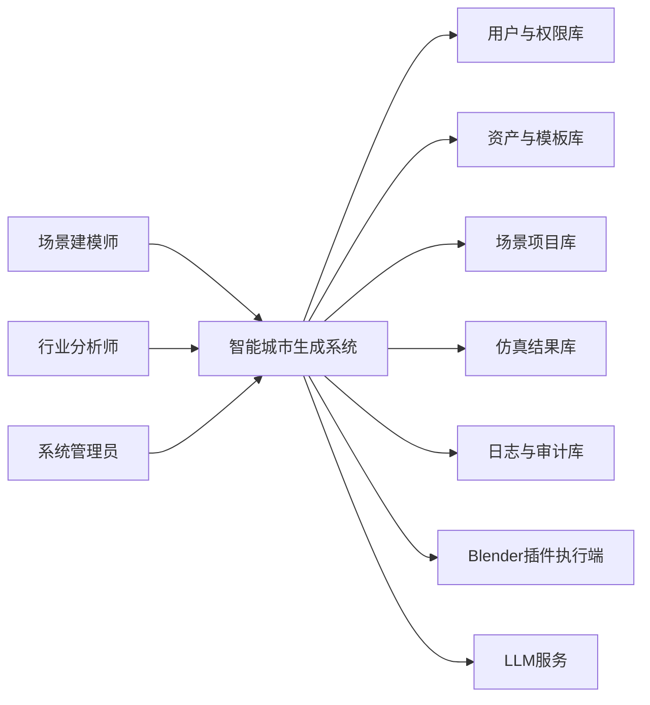
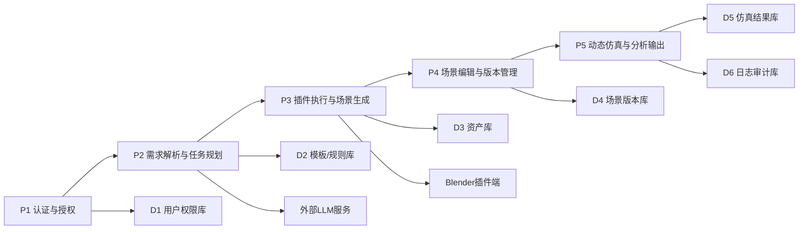

# 智能城市生成系统软件需求分析报告

学号：2312331  
姓名：王一诺  
课程：软件工程  
作业：第二次个人作业（需求分析）  
日期：2026-04-13

---

## 一、引言

### 1.1 编写目的

本报告用于明确“智能城市生成系统”的业务目标、使用场景、功能边界、数据需求与非功能要求，为后续概要设计、详细设计、实现开发和测试验收提供统一依据。报告将需求从“想法描述”转化为“可落地、可验证、可维护”的工程化条目，避免在开发过程中出现需求歧义、角色期望不一致和返工风险。

本报告的直接读者包括课程评阅教师、项目开发成员（前端/后端/算法/插件）、测试人员以及后续系统运维人员。对于不同读者，本报告分别提供业务流程层面的可理解性、功能条目层面的可实现性以及验收指标层面的可测量性，以确保同一份文档能够支持完整的软件生命周期。

此外，本报告特别强调与 Blender 插件、LLM 服务、多模态输入模块之间的协同关系。系统并非单一 Web 应用，而是“主系统 + 插件执行端 + 智能服务端”的复合架构，因此需要在需求阶段提前定义接口责任、执行边界和异常回退策略，确保系统在复杂任务下仍具备稳定性与可控性。

### 1.2 项目背景

随着大模型（LLM）在自然语言理解和任务规划方面能力持续增强，3D 城市场景生成正在从传统“手工建模 + 局部脚本”方式，向“自然语言驱动 + 程序化内容生成（PCG） + 可交互仿真”的新范式迁移。该范式能够显著降低场景构建门槛，提升大规模、多风格、可编辑城市内容的生产效率。

在实际业务中，场景建模师关注资产质量、布局可控性和编辑效率；行业分析师关注交通、人群、环境变量对仿真结果的影响；系统管理员关注权限、稳定性、审计和资源使用。传统工具链通常把这些角色割裂在不同系统中，导致信息回路长、协作成本高、版本一致性差。本项目希望通过统一平台整合多角色协同，缩短从需求到场景再到分析结论的路径。

因此，本项目定位为“面向场景生产与行业分析的一体化智能城市生成系统”，核心价值在于：使用多模态输入（文本、草图、点集、模板）驱动可解释的城市生成流程，并通过插件化执行机制与仿真模块形成闭环，使系统不仅能“生成城市”，还能“支撑分析决策”。

---

## 二、任务概述

### 2.1 任务目标

本系统目标是构建一个支持多角色协作的城市场景生成平台，使用户能够在较低门槛下完成从场景输入、布局控制、生态补全、动态仿真到结果导出的全流程工作。系统应支持文本与结构化输入并存，既满足快速生成，也满足精细化调整。

第一类目标是“生成效率目标”：用户在同等规模场景下，使用系统完成初始城市生成的时间应显著低于纯手工建模流程，并保留后续可编辑能力。第二类目标是“控制精度目标”：系统应允许用户通过模板、参数、点线集和草图等方式干预布局结果，避免“黑箱式一次生成不可改”的问题。第三类目标是“仿真可用目标”：输出场景应可挂接动态元素（车辆、人群、天气）并形成基础分析数据。

从课程作业视角，本项目任务还包括形成一份完整需求规格，至少覆盖用户角色、业务流程、数据结构、功能模块、性能指标和运行环境要求，使需求具备可验证性与可交付性，为后续课程实践提供可执行蓝图。

### 2.2 用户特点

场景建模师是主要生产角色，具备一定 3D 软件操作能力，对建模质量和参数可控性要求高，期望系统在“自动化”和“可编辑”之间保持平衡。这类用户通常会频繁调整资产、材质、道路连通、景观层次，属于高频交互用户。

行业分析师偏重结果解释和仿真指标，不一定深入掌握 Blender 细节，更关注交通流、人群分布、天气时段变化下的业务影响。其核心需求是“快速得到可分析场景”和“稳定导出分析结果”，对 UI 复杂度敏感，期望采用简化工作流。

系统管理员负责账号、权限、插件注册、任务队列、日志审计与故障处理，强调安全与稳定。管理员通常低频操作但影响范围广，任何误配置都可能导致系统级风险，因此需要严格的权限边界和可追溯日志机制。

### 2.3 假定与约束

系统假定运行环境具备可用的图形计算能力与网络条件，允许主系统调用 LLM 接口并与 Blender 插件端通信。若外部 LLM 服务中断，系统应降级为“规则模板 + 手动参数”模式，以保证核心生成能力可用。

项目约束体现在三方面。其一是技术约束：场景生成依赖 Blender 生态及插件接口规范，需遵守其脚本执行和版本兼容边界。其二是数据约束：输入草图、资产与模板需满足格式规范（例如图像格式、坐标系、单位标准），否则将影响联动结果。其三是资源约束：在课程项目环境下，不追求超大规模实时渲染，而以中等规模城市片区的稳定生成为主要目标。

此外，系统须遵守基本软件工程约束，包括权限最小化原则、日志可审计原则、接口文档化原则和版本可回溯原则。对于外部资产与模型调用，需满足版权和授权合规要求。

---

## 三、业务描述

### 3.1 系统总业务流程图及其描述

系统总体流程由“输入—生成—调整—仿真—导出”五段构成。用户首先完成身份认证，系统依据角色装配不同界面能力。项目创建后，用户可通过文本、模板、草图和点集输入场景意图，系统将输入转化为可执行任务序列并调用插件完成生成。

在完成第一轮自动生成后，用户可进行交互式修改，这一步是系统实用性的关键：它决定系统是否真正支持专业工作流，而非仅支持一次性演示。调整完成后进入动态仿真阶段，系统加载车辆、人群及环境变化并输出可分析结果，最终形成可追溯的版本与日志记录。

### 3.2 子业务流程一：多角色登录与权限分配

该流程保障系统安全性与角色职责隔离。场景建模师可访问资产和布局模块；行业分析师可访问仿真配置与结果分析模块；系统管理员可访问用户管理、插件配置和日志审计模块。权限并非仅控制页面可见性，还控制后端接口调用范围和数据读写范围。

流程关键点在于“权限策略一体化”。若仅前端做隐藏而后端未做鉴权，系统将存在越权风险。因此需求规定，所有关键接口需进行角色校验，管理员可查看审计记录并追踪越权尝试。

### 3.3 子业务流程二：资产加载与模板联动配置

模板联动是提升效率的核心机制。系统预置若干场景模板（如现代商务区、校园片区、滨水公园片区），每个模板绑定一组可编辑参数。用户修改关键选项后，系统自动联动相关子参数，减少重复配置成本并降低参数冲突概率。

资产管理要求支持“加载、替换、版本回滚”。当用户替换资产时，系统需检查模型规格（比例、坐标、材质依赖），避免渲染错误或场景错位。替换后系统自动生成新版本，确保用户可在历史版本间切换比较。

### 3.4 子业务流程三：布局与生态控制

布局控制需要同时支持“精确输入”和“视觉输入”。精确输入面向专业用户，通过点集实现道路或地块精确落点；视觉输入面向快速迭代，通过草图提取点线信息形成初始拓扑。系统在两类输入之上统一坐标标准，并执行约束校验，避免断路、重叠、穿模等问题。

生态元素生成是场景自然性与可分析性的重要组成。系统需在城市周边自动布设山体、水域和动态船只等对象，并与地形、道路、水系约束保持一致。若出现生态元素与人工设施冲突，系统应自动给出修正建议或提供半自动修复方案。

### 3.5 子业务流程四：LLM 多模态指令解析与插件执行（创新功能）

该流程是本系统创新价值所在。系统不仅接收自然语言文本，还能结合草图、模板参数等多模态信息，形成可执行任务链，并自动调用插件函数完成建模过程。相较传统“用户手动逐步点击”，该机制显著提升复杂场景下的生成效率。

为保障可控性，需求规定“执行前校验 + 执行后解释”双机制。执行前校验用于过滤高风险或不一致指令；执行后解释用于向用户展示“调用了哪些插件函数、传递了哪些参数、产生了哪些结果”，确保用户能够理解和追溯自动化决策。

### 3.6 子业务流程五：动态仿真与分析输出

动态仿真环节面向行业分析目标。系统需支持为车辆与人群定义社会规则约束，如道路优先、行人避让、区域限行、密度阈值等，并通过天气和时间参数变化观察系统行为差异。该流程强调“可重复实验”，同一配置应可重复运行并得到可比较结果。

最终输出应覆盖两类产物：一类是可继续编辑的场景与配置文件，便于后续迭代；另一类是分析类结果（轨迹、密度热力、拥堵指标、事件日志），便于业务汇报与决策支持。

---

## 四、数据需求

### 4.1 数据需求描述

系统数据可分为主数据、过程数据、结果数据三类。主数据包括用户、角色、权限、资产库、模板库和插件注册信息，强调稳定性与一致性。过程数据包括场景参数、点线集、草图解析结果、任务队列与执行日志，强调时序性与可追踪性。结果数据包括渲染结果、仿真轨迹、统计指标与报告文件，强调可复用与可对比。

数据生命周期遵循“创建—版本化—归档”策略。任何对场景结构有影响的操作都应触发版本记录，且支持按版本恢复。日志数据需覆盖用户操作、系统决策、插件调用与异常信息，用于问题定位和审计。

数据质量要求体现在完整性、合法性与一致性。系统需在写入前执行字段校验（格式、范围、必填项），并通过外键或引用规则保证实体间关系有效。例如场景项目删除时，应处理关联仿真记录和导出文件的归档策略，避免产生悬挂数据。

### 4.2 数据流图

#### 4.2.1 顶层数据流图（DFD-0）

顶层数据流反映系统边界与外部实体关系。用户输入经主系统处理后，一方面读写内部数据存储，另一方面调用外部执行与智能服务。外部服务结果回流系统后再进入项目数据与日志数据，形成闭环。

#### 4.2.2 一级数据流图（DFD-1）

一级数据流体现了系统内部处理链路：授权通过后进入需求解析，解析结果驱动插件执行，执行产物在编辑模块中形成版本，再进入仿真模块输出结果。日志审计贯穿各处理节点，支撑可解释与可追溯要求。

### 4.3 数据字典

| 数据项 | 含义 | 来源 | 去向 | 核心字段 | 约束说明 |
|---|---|---|---|---|---|
| User | 系统用户信息 | 注册/管理员创建 | 认证模块、审计模块 | user_id, username, role_id, status | username 唯一，status 枚举 |
| Role | 角色定义 | 管理员配置 | 权限判断 | role_id, role_name | role_name 唯一 |
| Permission | 权限点 | 管理员配置 | 接口鉴权 | perm_id, perm_code, perm_scope | 与 role 形成多对多 |
| SceneProject | 场景项目主表 | 建模师/分析师创建 | 生成、编辑、仿真 | project_id, owner_id, template_id, version | project_id 唯一，owner 必填 |
| SceneVersion | 场景版本记录 | 系统自动生成 | 回滚、比较、导出 | version_id, project_id, snapshot_uri, created_at | 同项目版本号递增 |
| Asset | 2D/3D 资产元数据 | 资产导入 | 生成模块 | asset_id, asset_type, format, uri, license | format 必须在白名单 |
| Template | 场景模板配置 | 管理员/建模师维护 | 联动配置模块 | template_id, template_name, param_schema | schema 必须可解析 |
| LayoutPointSet | 手动布局点集 | 用户输入 | 布局计算模块 | pointset_id, project_id, points_json, coord_sys | 坐标系需标准化 |
| SketchVectorSet | 草图提取点线集 | 图像解析模块 | 布局修正模块 | vector_id, project_id, lines_json, confidence | confidence 范围 0~1 |
| EnvConfig | 环境参数配置 | 用户/LLM生成 | 天气与天色控制 | env_id, weather, time_of_day, light_param | 参数越界需回退默认 |
| SimulationRule | 动态仿真规则 | 分析师配置 | 仿真引擎 | rule_id, vehicle_rule, crowd_rule | 规则需通过一致性校验 |
| TrajectoryRecord | 轨迹结果 | 仿真引擎 | 分析报表 | traj_id, entity_type, timestamps, path | 时间戳单调递增 |
| CommandTask | 智能指令任务 | 文本/多模态输入 | 任务调度器 | task_id, intent, plan_json, status | status 生命周期受控 |
| PluginFunctionMap | 插件函数映射 | 管理员注册 | 执行引擎 | func_id, plugin_name, signature, risk_level | 高风险函数需二次确认 |
| OperationLog | 操作与审计日志 | 系统全模块 | 审计与监控 | log_id, actor_id, action, result, time | 不可物理删除，仅归档 |

数据字典定义了系统主要信息对象及约束边界。通过统一字段语义和格式要求，可降低跨模块协作时的数据歧义，提升接口开发效率。对于高风险对象（如插件函数映射、权限与日志），必须满足更严格的变更审计机制。

---

## 五、功能需求

### 5.1 功能划分

系统功能划分为九个一级模块：用户与权限管理、项目与版本管理、资产与模板管理、布局控制、生态生成、智能交互、动态仿真、分析导出、系统管理与审计。该划分遵循“业务主线完整、角色职责清晰、模块边界稳定”的原则，既支撑课程作业实现，也保留后续扩展空间。

从依赖关系看，用户与权限是基础模块；项目、资产、布局和生态共同构成静态场景生成链路；智能交互用于降低操作门槛并提升自动化；动态仿真和分析导出构成业务闭环；系统管理与审计横向支撑全流程安全与可维护性。

### 5.2 功能描述

#### FR-01 多角色登录与权限分配

系统应支持场景建模师、行业分析师、系统管理员三类角色登录。登录成功后，系统按角色动态加载菜单、页面和可用操作按钮，未授权能力不得暴露。

系统后端接口必须执行角色鉴权与资源鉴权双校验。任何越权访问请求均应被拒绝并写入审计日志。管理员可查看账号状态、权限变更记录与异常登录行为。

#### FR-02 主系统与 Blender 插件交互入口

系统应提供统一的插件执行入口，支持从主系统发起插件任务、接收执行状态和返回结果。用户无需直接操作底层脚本即可触发生成流程。

交互入口需提供任务可视化状态（排队、执行中、成功、失败）和异常提示。失败任务应支持重试和错误定位信息查看，便于用户快速恢复业务流程。

#### FR-03 2D/3D 资产加载与替换

系统应支持 2D/3D 资产导入、分类检索、加载预览和替换更新。资产替换后应触发场景重建并生成新版本，不覆盖历史结果。

加载和替换过程中，系统需校验资产格式、比例、坐标和依赖资源完整性。对于不兼容资产，应给出明确错误原因并阻断不安全写入。

#### FR-04 模板选择与参数自动联动

系统应支持模板化建模流程。用户选择模板后，系统自动填充默认参数，并根据用户对关键选项（如树木、道路、座椅类型）的修改联动更新相关参数。

联动规则需可配置、可维护，允许管理员和高级用户扩展模板规则。若联动后出现参数冲突，系统应给出冲突提示并提供修正建议。

#### FR-05 手动点集精确布局控制

系统应支持用户输入点集/线集进行道路与地块精确布局，保证关键几何位置可控。系统需提供基本几何校验，包括重复点、断线、越界、自相交检查。

布局结果应可视化展示并支持局部编辑。用户可在不破坏整体结构的前提下进行微调，并保留版本差异信息以供比较。

#### FR-06 草图点线自动提取与布局修改

系统应支持导入草图图像，自动提取点线集并映射到标准坐标系，用于快速生成或修正布局。提取结果应给出置信度，便于用户判断可用性。

对低置信度区域，系统应支持人工校正后再应用，避免错误传播到后续生成链路。该机制兼顾自动化效率与结果可靠性。

#### FR-07 周边生态元素自动生成

系统应支持在城市周边生成山峦、湖泊和动态船只等生态元素，并与已有道路、地块、建筑保持空间约束一致。生成过程需考虑碰撞与遮挡冲突。

生态生成应允许用户设定强度参数（密度、范围、风格）并实时预览。若冲突无法自动修复，系统应给出可执行的人工处理建议。

#### FR-08 LLM 驱动的自然语言场景控制

系统应支持通过自然语言对天气、天色、环境氛围等场景参数进行控制，并将用户意图转换为可执行配置。系统应展示解析结果供用户确认。

当自然语言存在歧义时，系统应触发澄清机制或采用安全默认值，避免直接执行高风险修改。所有自动解释结果应记录到任务日志中。

#### FR-09 创新功能：LLM 多模态指令解析并自动调用插件函数

系统应支持综合文本、草图、模板参数等多模态输入，自动生成插件调用函数链，完成复杂建模任务。该能力应覆盖函数检索、参数映射、执行排序和异常回退。

系统必须提供“可解释执行清单”，至少包含调用函数名、关键参数、调用顺序、执行结果和错误信息。用户应可基于清单进行复现和审计。

#### FR-10 社会规则约束的车辆与人群动态模拟

系统应支持车辆与人群的动态仿真，行为轨迹应满足基本社会规则约束，如道路可达性、区域限制、避碰与优先级规则。仿真支持多轮运行与参数对比。

系统需输出轨迹数据和统计指标，为行业分析提供基础证据。若规则冲突导致仿真失败，应输出冲突说明并指导用户修正。

#### FR-11 分析结果导出

系统应支持导出场景文件、渲染截图、仿真轨迹和分析摘要，格式包含可编辑文件与可阅读报告。导出记录需可追溯到具体项目版本和仿真配置。

对同一项目不同版本，系统应支持对比导出，帮助分析用户观察参数变化对结果的影响，提升分析结论可信度。

#### FR-12 系统管理与审计

系统应支持管理员进行用户管理、权限配置、插件注册、模型服务配置和日志审计。关键操作需二次确认，并记录操作人、时间、变更前后内容。

审计模块应支持按用户、时间、项目、操作类型筛选日志，并提供异常告警能力，确保系统可维护、可监管。

---

## 六、性能 / 非功能需求

### 6.1 准确性

系统应保证结构化输入解析准确，点线数据映射误差可控。对于草图提取，系统应输出置信度并支持人工修正，以确保下游布局质量。LLM 指令解析必须经过语义合法性校验，避免无效或危险参数直接执行。

仿真结果的准确性要求体现在规则一致性与统计一致性。相同输入配置重复运行时，关键统计指标波动应处于可接受范围，保证分析报告具备比较价值。

### 6.2 及时性

系统应保证基础交互响应及时。普通页面操作响应建议不超过 2 秒；中等复杂度场景初次生成建议在 2~5 分钟内完成；仿真任务应提供进度反馈并支持后台执行，避免阻塞前台操作。

对于外部服务延迟（如 LLM 调用或插件任务排队），系统需提供明确状态提示和超时处理机制，确保用户能够感知系统当前阶段，减少“无反馈等待”。

### 6.3 可扩充性

系统采用插件化和模块化设计，新增资产类型、模板规则、仿真规则或外部模型服务时，不应破坏现有核心流程。插件函数需通过统一注册表管理，避免耦合在业务代码中。

数据结构设计需预留扩展字段和版本标记，支持后续新增指标、策略与模型参数。接口应维持向后兼容策略，降低升级成本。

### 6.4 易用性

系统界面应按角色简化信息密度，避免将专业配置暴露给非目标角色。关键流程应提供引导提示和默认值，降低初次使用门槛。对于高复杂度步骤（如草图解析、规则配置），应有清晰反馈与错误说明。

系统应支持结果可视化和版本对比，帮助用户通过直观方式判断调整效果，而不依赖纯文本日志。

### 6.5 易维护性

系统应建立统一日志规范、错误码规范与接口文档规范。模块间通信应有清晰边界，便于定位故障责任。对外部依赖（LLM、插件、渲染）应具备健康检查与降级策略。

运维层面需支持配置集中管理与版本化，避免环境差异引发“同功能不同结果”的问题。关键变更操作需审计可回放，支持问题追踪。

### 6.6 标准性

系统开发需遵循统一编码规范、命名规范和接口规范。数据交换建议采用标准 JSON 结构并附带 schema 说明，时间与坐标字段使用统一格式。文档交付需包含接口说明、部署说明和测试说明。

用户权限、安全审计、资产授权等方面需符合学校课程项目和常见工程合规要求，形成可审查证据链。

### 6.7 先进性

系统在传统城市建模工具基础上引入 LLM 多模态解析和自动函数链调用机制，体现“智能化编排 + 可解释执行”的先进性。该能力不仅提升效率，也为后续接入更复杂智能体框架奠定基础。

同时，系统保留人工干预入口与版本化回滚机制，避免“全自动不可控”的风险，实现先进性与工程可控性的平衡。

### 6.8 安全性与可靠性

系统应采用最小权限原则和安全默认值策略。敏感操作（权限变更、插件高风险调用、批量删除）需二次确认并记录审计。用户身份信息与关键配置数据应安全存储，防止泄露和篡改。

可靠性方面，系统应具备异常恢复能力，包括任务重试、失败回滚、断点续跑和降级执行。在外部服务不可用时，核心业务应保持“可继续工作”的最低能力。

---

## 七、系统运行要求

### 7.1 硬件配置要求

推荐服务器端至少具备 8 核 CPU、32GB 内存和可用 GPU（显存建议 8GB 及以上）以支持中等规模场景生成和仿真任务。若采用单机课程演示环境，建议配置独立显卡和 SSD，以保障渲染与数据读写效率。

客户端最低要求为可流畅运行现代浏览器与基础 3D 预览能力。对于建模师高强度使用场景，建议配置多核心 CPU、16GB 及以上内存和中高端显卡，以降低预览卡顿。

### 7.2 软件配置要求

服务端建议使用 Windows 或 Linux 稳定版本操作系统，部署 Web 服务、任务调度服务、数据库服务和日志服务。Blender 版本需与插件版本兼容（建议固定主版本并进行回归验证）。

系统需具备 Python 运行环境用于插件脚本执行与任务编排，并配置可访问的 LLM 服务接口。数据库可采用关系型数据库存储核心业务数据，并结合对象存储管理大文件资产和渲染结果。

### 7.3 网络与部署要求

系统应部署在网络稳定环境，主系统与插件执行端、LLM 服务端之间具备可靠通信。跨模块调用需设置超时、重试与熔断策略，防止单点故障放大。

部署建议区分开发、测试、演示三个环境，使用配置隔离与版本标记避免环境污染。课程作业场景可先采用单环境部署，但仍应保留最基本的配置分层能力。

### 7.4 运行与运维要求

系统启动前需完成插件注册检查、模型服务连通性检查和资产索引完整性检查。运行过程中应持续采集关键指标（任务成功率、平均生成时长、接口错误率、资源占用率）并形成监控面板。

系统应支持定期备份项目数据、版本数据和日志数据，确保关键成果可恢复。发生故障时，管理员可根据审计链快速定位问题，执行回滚或重试流程，保障教学演示与作业交付连续性。

---

## 附：验收建议（可用于答辩）

1. 场景建模师账号完成“模板 + 点集 + 草图”三种输入方式生成，并成功替换 2 类资产。  
2. 行业分析师账号完成至少 1 组天气变化下的车辆/人群仿真，对比导出统计结果。  
3. 管理员账号展示权限控制、插件注册、异常日志检索与审计追踪。  
4. 演示创新功能：输入多模态指令后系统自动生成插件调用链，并展示可解释执行清单。  
5. 演示失败回退：人为构造不合法参数，系统正确阻断并给出可操作修正提示。

以上验收项可直接映射到本报告功能与非功能条目，用于证明需求具备可实现性与可验证性。
